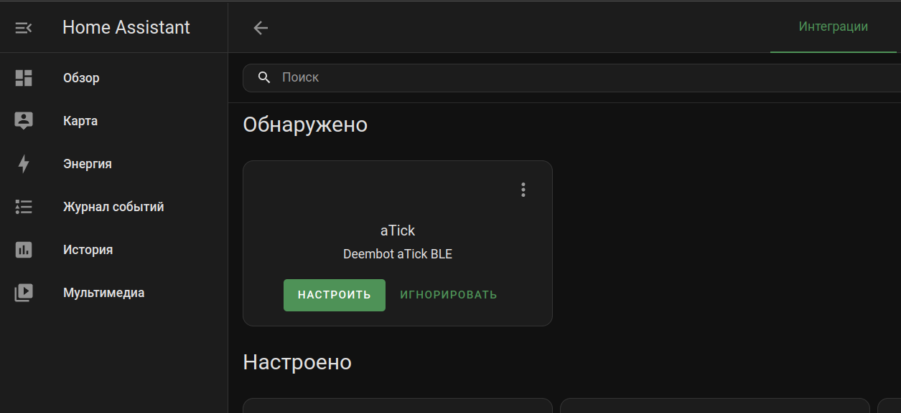
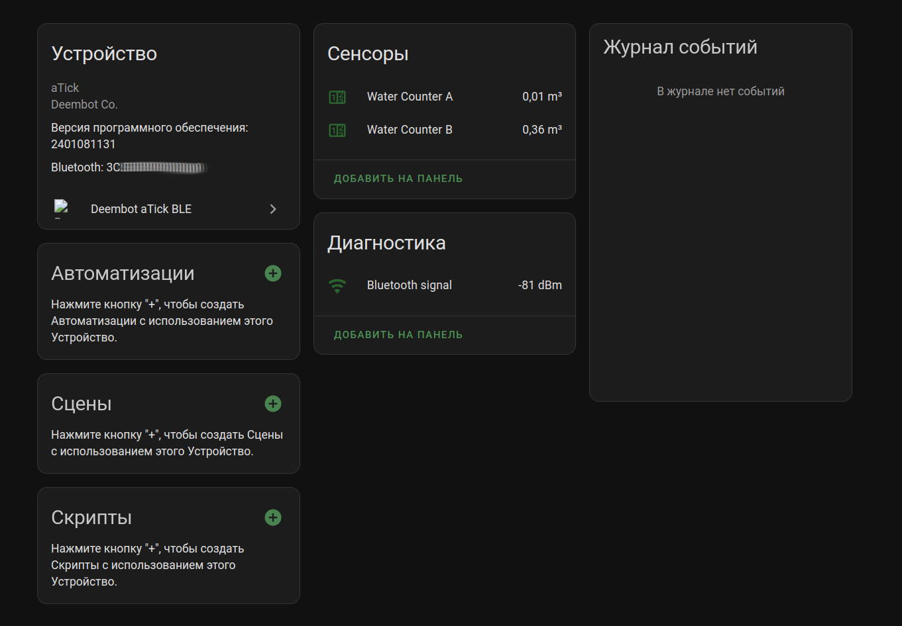

# Home Assistant Deembot aTick BLE Integration

Интеграция для работы с устройством [aTick](https://deembot.com/atick/index.ru.html) от компании Deembot.

> Внимание! Это Альфа версия, в которой реализована только базовая передача показаний от aTick, пока что больше ничего не умеет!
> Подключать само устройство стоит только в базовой конфигурации!
> Разные настройки через приложения могут не поддерживаться и привести к некорректности передаваемых данных.
> В дальнейшем, интеграция должна догнать оф. приложения для Android

Можно одновременно пользоваться, и HA интеграцией, и оригинальным приложением. Заранее требуется указать нужный вам ПИН в приложении для сопряжения устройства

## Установка и Настройка

Добавить интеграцию, скопировав содержимое `custom_components` в вашу директорию в HA `/usr/share/hassio/homeassistant/custom_components`

Перезагрузить HA.
После перезагрузки, устройство будет обнаружено автоматически или нужно добавить в ручную, зайти в интеграции и нажать "Добавить интеграцию". В поиске ввести aTick. Следовать шагам настройщика.

> Внимание! Одновременно работа в приложении для телефона и HA невозможно, так что перед началом настройки, выйдите из приложения и отключите bluetooth на телефоне, чтобы устройство точно нашлось
> В списке устройств должен появится ваш aTick который и следует выбрать.

## Доработка

Все желающие, кто может внести улучшения, присылайте PR

Что нужно реализовать:
* Получение/Сохранение настроек устройства в интерфейсе
* Добавить изображение интеграции
* Корректный поиск устройства если оно переименовано
* Корректный расчёт с учётом множителя
* Корректировка показаний (задать начальные показания)
* Настройки энергосбережения (как в приложении)
* Добавить интеграцию в HACS

#### Внешний вид

